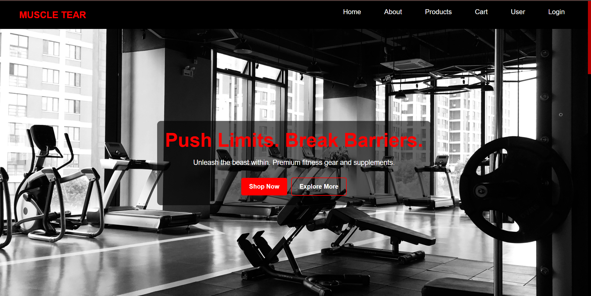
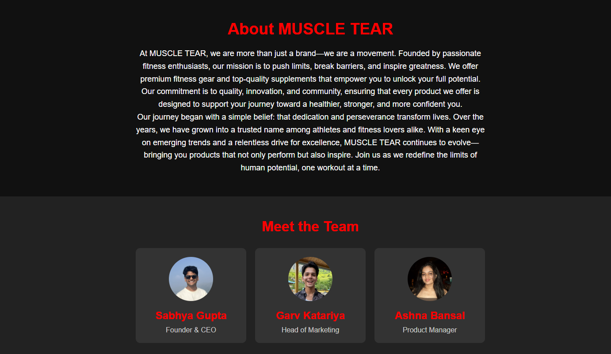
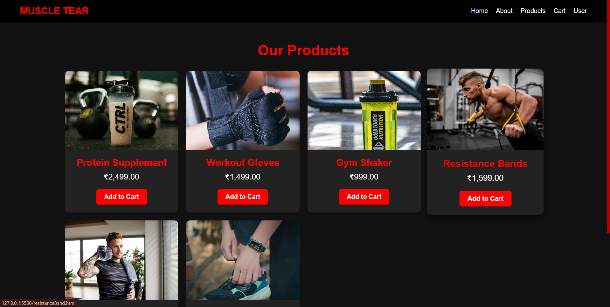
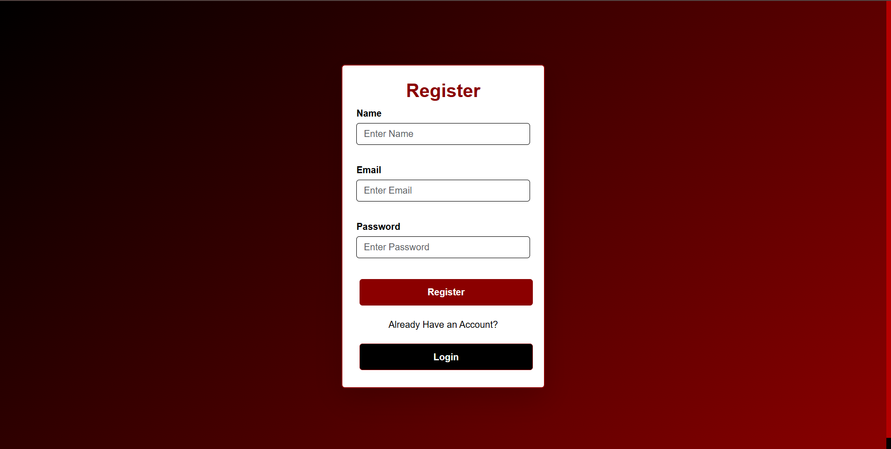

# Muscle Tear (Version 3)

This version of Muscle Tear builds upon the previous e-commerce platform by expanding the product offerings and introducing user authentication for a more personalized experience.

## Key Updates

* **Expanded Product Catalog:** Discover a wider selection of gym supplements to meet diverse fitness needs.
* **User Authentication:** Securely create accounts, log in, and manage your profile.

## Features

* **Home Page:** The main landing page showcasing featured products!
    <p align="center">
  
</p>
    
* **About Page:** Learn more about our team and mission!
    <p align="center">
  
</p>

* **Products Page:** Have a look at our Products!
    <p align="center">
  
</p>

* **SignUp and Login Page:** Existing users can securely log in to their accounts, else Sign Up!
        <p align="center">
  
</p>

## Tech Stack

* **Frontend:** React, Vite, CSS
* **Backend:** Node.js, Express.js
* **Database:** MongoDB

## Setup Instructions

1.  **Clone the repository:**
    ```bash
    git clone [https://github.com/your-username/muscle-tear.git](https://github.com/your-username/muscle-tear.git)
    cd muscle-tear
    ```

2.  **Install Dependencies:**

    * **Frontend:**
        ```bash
        cd client
        npm install
        ```
    * **Backend:**
        ```bash
        cd server
        npm install
        ```

3.  **Configure Environment Variables:**
    Create a `.env` file in the `server` directory with your MongoDB connection string and secret key:
    ```
    MONGO_URI=your_mongo_connection_string
    SECRET_KEY=your_secret_key
    ```

4.  **Run the Application:**

    * **Backend:**
        ```bash
        cd server
        npm run dev
        ```
    * **Frontend:**
        ```bash
        cd client
        npm run dev
        ```
    Open your browser to `http://localhost:3000` to view the app.

## Next Steps

Future enhancements may include order confirmation, payment gateway integration, responsive design, user profiles with order history, and email notifications.

## License

MIT License - see the [LICENSE](LICENSE) file for details.